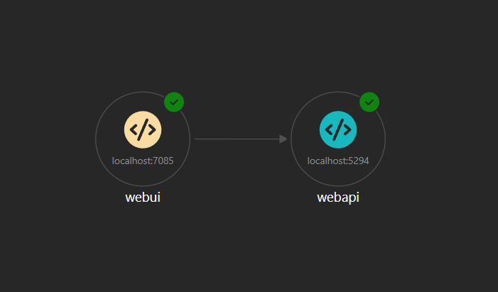

# Yucca

## Overview
Yucca is a comprehensive tool for managing inventory, sales, clients, suppliers, and financial operations for small to medium-sized businesses.

## Web Application Architecture



## Running Yucca as an Aspire Solution via Yucca.AppHost

To run Yucca as an Aspire solution, follow these steps:

1. **Navigate to the Project Directory**:
   Open a terminal and navigate to the `Yucca` project directory:
   ```bash
   cd d:\source\yucca
   ```

2. **Run the Program via the IDE**:
   Start a debug session by setting Yucca.AppHost as the startup project and start the application (F5 in Visual Studio).

   A new browser tab will be launched automatically to show the Aspire dashboard.

3. **Run the Aspire Application via CLI**:
   Use the following command to start the application:
   ```bash
   dotnet run --project Yucca.AppHost/Yucca.AppHost.csproj
   ```

   Open https://localhost:17030 inside your browser to access the Aspire dashboard.

---

## Running the Yucca Program from the Console

The Yucca program can be run directly from the console to perform various operations.

### Steps to Run the Program

1. **Navigate to the Project Directory**:
   Open a terminal and navigate to the `Yucca` project directory:
   ```bash
   cd d:\source\yucca\Yucca
   ```

2. **Run the Program**:
   Use the following command to run the program:
   ```bash
   dotnet run
   ```

3. **Command-Line Arguments**:
   - To display information about the application, use the `--about` argument:
     ```bash
     dotnet run -- --about
     ```
   - To list all suppliers, use:
     ```bash
     dotnet run -- supplier list
     ```
   - To add a supplier, use:
     ```bash
     dotnet run -- supplier add "Supplier Name"
     ```
   - If no valid arguments are provided, the program will display a message indicating the available options.

---

## Accessing the WebAPI

The Yucca WebAPI provides endpoints to interact with the application programmatically. Swagger is used to document and test the API.

### How to Use Swagger

1. **Run the WebAPI**:
   Navigate to the `Yucca.WebAPI` project directory and start the WebAPI using the following command:
   ```bash
   dotnet run --project Yucca.WebAPI/Yucca.WebAPI.csproj
   ```

2. **Access Swagger UI**:
   Once the WebAPI is running, open your browser and navigate to:
   ```
   https://localhost:5294/swagger
   ```
   This will open the Swagger UI, where you can explore and test the available API endpoints.

3. **Testing Endpoints**:
   - Use the Swagger UI to send requests to the API.
   - You can view the request and response details for each endpoint.

4. **OpenAPI Specification**:
   If you need the OpenAPI specification (JSON format), it is available at:
   ```
   https://localhost:5294/swagger/v1/swagger.json
   ```

### Example Endpoint: About API
The `About` API provides information about the application. You can test it using the following endpoint:
```
GET /api/about
```

This will return details such as the application title, description, and version.